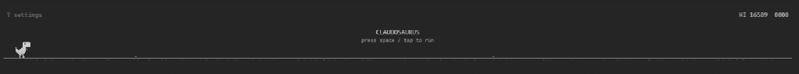

# Claudosaurus



Turn Claude Code's idle wait into play time. While Claude is working, the "thinking" spinner in the chat panel is replaced with a playable, monochrome, Chrome-style dinosaur game.

This patches the **Claude Code extension webview** (the chat panel UI) in any editor that ships it (Antigravity, VS Code, VS Code Insiders, Cursor, Windsurf). It is a lightweight, zero-dependency tool (~75 KB package size).

> **Note:** This patches your local Claude Code extension's `webview/index.js` file. A backup (`.claudosaurus-bak`) is automatically created for easy uninstallation.

---

## Controls

* **Jump / Start / Restart**: `Space`, `Up Arrow`, or **Left Click** / **Touch Tap** on the game canvas.
* **Settings Menu**: Press `?` (question mark key) to toggle settings; `Escape` to close.

---

## Installation

### Option 1: Via npm (Recommended)
Run it directly with `npx` (no download or clone needed):
```bash
npx claudosaurus
```
Or install it globally:
```bash
npm install -g claudosaurus
claudosaurus
```

### Option 2: Local Clone (For Edits & Development)
If you want to modify the game or contribute:
```bash
git clone https://github.com/animeshlego5/Claudosaurus.git
cd Claudosaurus
npm install
node cli.js install
```

*After installing, reload your editor window (Command Palette -> **Developer: Reload Window**) to apply the patch.*

---

## Uninstall

To restore the original extension files:
```bash
# If using npm / npx:
npx claudosaurus uninstall

# If using a local clone:
node cli.js uninstall
```
Then reload your editor window.

---

## Development & Offline Testing

### Standalone Browser Harness
Play and develop the game offline in any browser with zero token usage:
- **Windows**: `start game.html`
- **macOS**: `open game.html`
- **Linux**: `xdg-open game.html`

### Live Editor Spinner Test
To test changes against a live, infinite spinner in the editor:
1. Run the black-hole HTTP server:
   ```bash
   node hang-server.js
   ```
2. Launch your editor pointing to it:
   ```bash
   ANTHROPIC_BASE_URL=http://localhost:8787 code .
   ```

---

## Options

These flags work with both `claudosaurus` (npm) and `node cli.js` (clone):
- `--all`: Apply the patch/uninstall to every editor copy found (VS Code, Cursor, Antigravity, etc.).
- `--dry-run`: Preview the changes without modifying files.

---

## License
MIT
